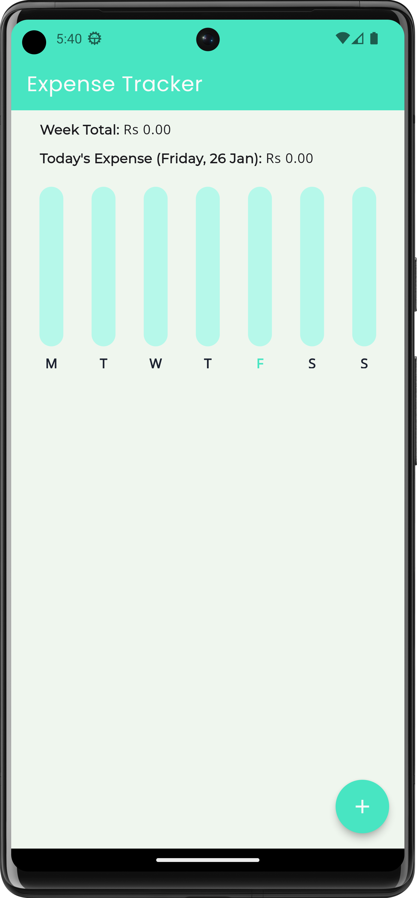
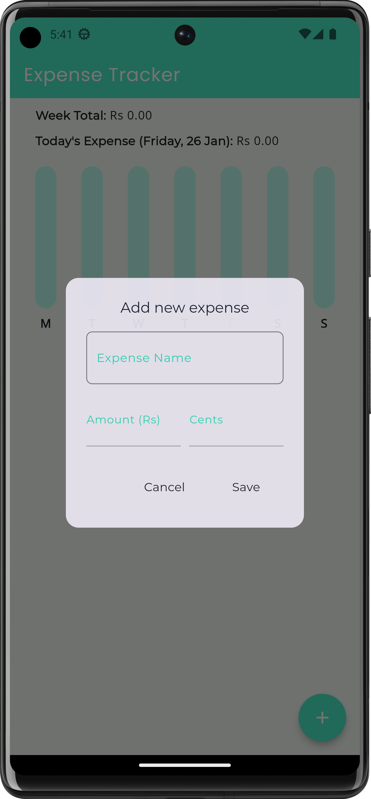
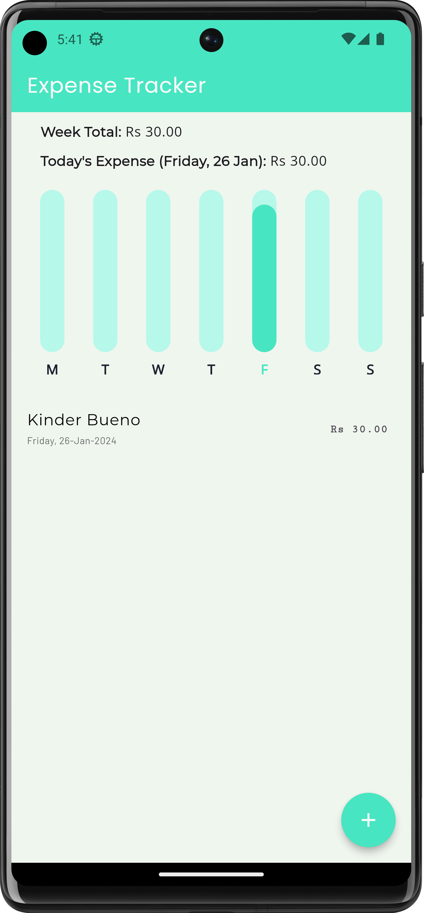
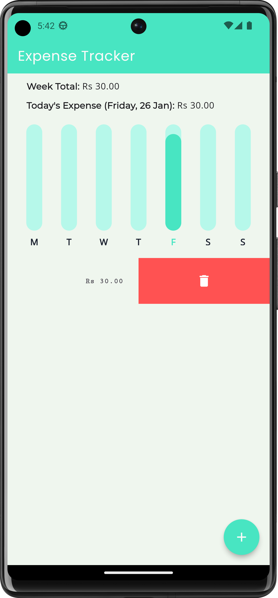

# Expense Tracker

**An app to track your expenses** 
Expense Tracker is an application is designed to streamline the tracking of your daily and weekly expenses. With user-friendly features, it simplifies the recording and management of your spending, offering a clear overview of your financial activities. Maintain organization with a comprehensive record of your expenditures, empowering you to make informed decisions about your budget. Effortlessly monitor your expenses, gain insights into your spending habits, and take charge of your financial journey with this intuitive expense tracking app.

**Screenshots**  
                     
